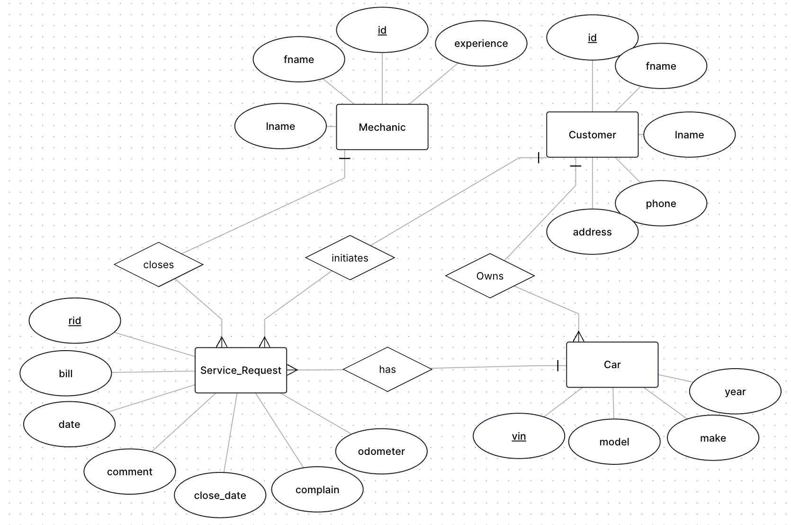

# Mechanic Shop
A database system for managing a mechanic shop for CS 166 (Database Management Systems) Final Project.

## Overview
This project implements a database for a mechanics shop that tracks customers, cars, mechanics, service requests, and billing information.

## ER Diagram 


## Tech Stack
- **Database:** PostgreSQL
- **Client Application:** Java (JDBC)
- **Schema:** SQL

## Project Structure
- `MechanicShop.java` — JDBC 
- `create-tables.sql` — CREATE TABLE statements
- `create-indexes.sql` — INDEX statements
- `.gitignore` - Added file with example Java code from Lab 6 template
- `images/` - ER Diagram
- `data/` — CSV files with dummy data

## Setup
1. Create the PostgreSQL database
2. Run `create-tables.sql` to build the schema
3. Load dummy data from CSV files
4. Compile and run the Java client:
   ```bash
   javac MechanicShop.java
   java MechanicShop
   ```

## Features
- Add customers, mechanics, and cars
- Initiate and close service requests
- Query service history, billing, and car information

## Authors
Moses Avila & Adolfo Magallanes
